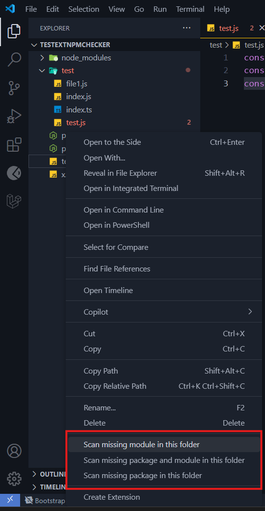

# 📦 NPM Module Checker

<p align="center">
	
</p>

<p align="center">
  
  
  
  
</p>

NPM Module Checker is a VSCode extension that helps you identify and fix missing **`npm packages`** or **`modules/files`** in your project. It provides quick fixes for missing files and packages, both locally and globally.

## ✨ Features

- Detect missing **`npm packages`** and **`modules/files`** in your project.
- Provide quick fixes to **`install missing packages`** or **`create missing modules/files`**.
- **`Scan entire`** folders or projects for missing packages and modules/files.
- **`Log detailed information`** about issues found and actions taken.

## 📥 Installation

### From Visual Studio Code Marketplace

1. Open VSCode.
2. Go to the Extensions view by clicking the Extensions icon in the Activity Bar on the side of the window.
3. Search for `NPM Module Checker`.
4. Click `Install`.

Alternatively, you can download and install the extension from the [Visual Studio Code Marketplace](https://marketplace.visualstudio.com/items?itemName=ntkhang03.npm-module-checker).

### From Source

1. Clone the repository:
   ```sh
   git clone https://github.com/ntkhang03/NPM-Module-Checker.git
   ```

2. Navigate to the project directory:
   ```sh
   cd npm-module-checker
   ```

3. Install dependencies:
   ```sh
   npm install
   ```

4. Build the extension:
   ```sh
   npm run build
   ```

5. Package the extension:
   ```sh
   npm run package
   ```

6. Install the extension in VSCode:
   - Open VSCode.
   - Go to the Extensions view by clicking the Extensions icon in the Activity Bar on the side of the window.
   - Click the three-dot menu at the top-right corner of the Extensions view and select "Install from VSIX...".
   - Select the generated `.vsix` file from the `npm-module-checker` directory.

## 🚀 Usage

### Quick Fixes

When you open a JavaScript or TypeScript file that has missing packages or modules, the extension will highlight the issues and provide quick fixes. You can apply the quick fixes by clicking on the lightbulb icon or pressing `Ctrl+.` (Windows/Linux) or `Cmd+.` (Mac).

### Context Menu Commands

You can also scan entire folders or projects for missing packages and modules using the context menu commands. Right-click on a folder or in the Explorer view and select one of the following options:

- **Scan missing package in this folder**
- **Scan missing module in this folder**
- **Scan missing package and module in this folder**

### Output Channel

The extension logs detailed information about the issues found and actions taken in the "NPM package checker" output channel. You can view the output by opening the Output panel (`Ctrl+Shift+U` or `Cmd+Shift+U`) and selecting "NPM package checker" from the dropdown menu.

## ⚙️ Settings

You can customize the behavior of the extension through the following settings:

- `npmModuleChecker.ignoreFilesOrFolders`: Files or folders to ignore during the check (supports regex), e.g., `["node_modules", "dist", "build", "/*.test.js"]`.
- `npmModuleChecker.checkInsideStrings`: Check for missing modules inside strings.
- `npmModuleChecker.enableDiagnosticsJavascript`: Enable diagnostics for JavaScript files.
- `npmModuleChecker.enableDiagnosticsTypescript`: Enable diagnostics for TypeScript files.
- `npmModuleChecker.enableDiagnosticsJavascriptreact`: Enable diagnostics for JavaScript React files.
- `npmModuleChecker.enableDiagnosticsTypescriptreact`: Enable diagnostics for TypeScript React files.
- `npmModuleChecker.customIgnorePackages`: Custom packages to ignore during the check.
- `npmModuleChecker.packageInstalledGlobalSeverity`: Severity level for packages installed globally.
- `npmModuleChecker.missingPackageDependencySeverity`: Severity level for missing package dependencies.
- `npmModuleChecker.packageInstalledDevDependencySeverity`: Severity level for packages installed as dev dependencies.
- `npmModuleChecker.missingFileIndexSeverity`: Severity level for missing index files.
- `npmModuleChecker.missingFileSeverity`: Severity level for missing files.

## 📸 Screenshots

Here are some screenshots demonstrating the features of the NPM Module Checker extension:

### Diagnostics (Missing Package)


### Diagnostics (Missing Module/File)


### Quick Fixes (Missing Package)


### Quick Fixes (Missing Module/File)


### Context Menu Commands


- You can scan entire folders or projects for missing packages and modules using the context menu commands. Right-click on a folder or in the Explorer view and select one of the following options:
	- **Scan missing package in this folder**
	- **Scan missing module in this folder**
	- **Scan missing package and module in this folder**

### Output Channel


- When you choose to scan for missing packages or modules in a directory, the extension logs detailed information about the issues found and actions taken in the "NPM Package Checker" output channel. A notification will be displayed with a dialog asking if you want to fix the issues. If you choose "**Yes**" the extension will **automatically install** the **missing packages** and **create the missing modules/files**.

### Validate ignore patterns


- You can validate the ignore patterns in the settings to ensure they are correctly formatted.

### Settings


## 🤝 Contributing

Contributions are welcome! If you have any suggestions, bug reports, or feature requests, please open an issue on the [GitHub repository](https://github.com/ntkhang03/NPM-Module-Checker/issues).

## 📄 License

This project is licensed under the MIT License. See the [LICENSE](LICENSE) file for details.